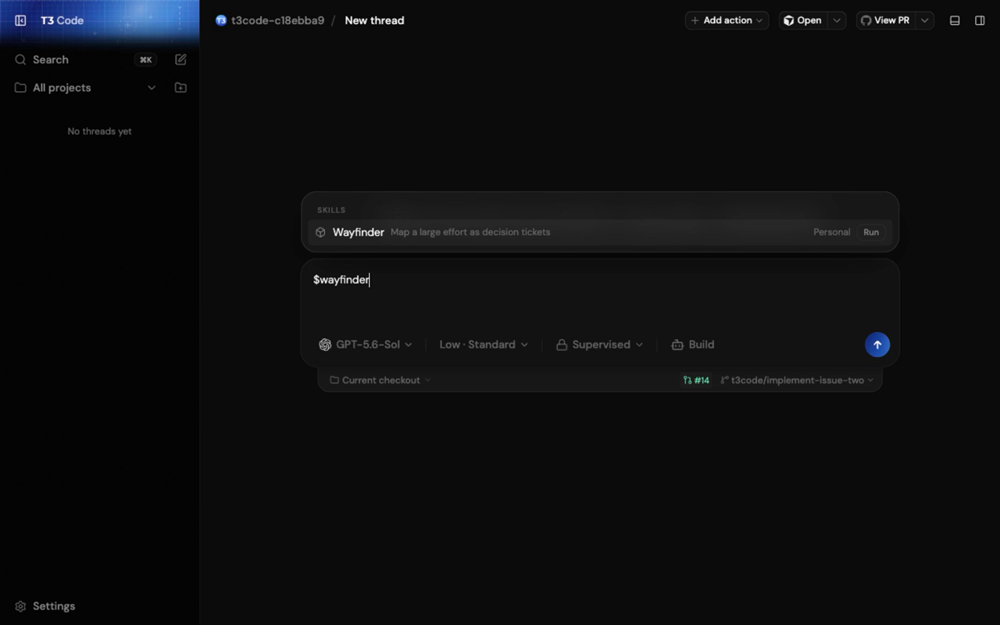

# Native Wayfinder run evidence

The screenshot shows the explicit `Run` control for the Wayfinder skill. The
[recording](./native-wayfinder-run.mp4) captures the same control starting a
native Codex turn and rendering its completed response.

